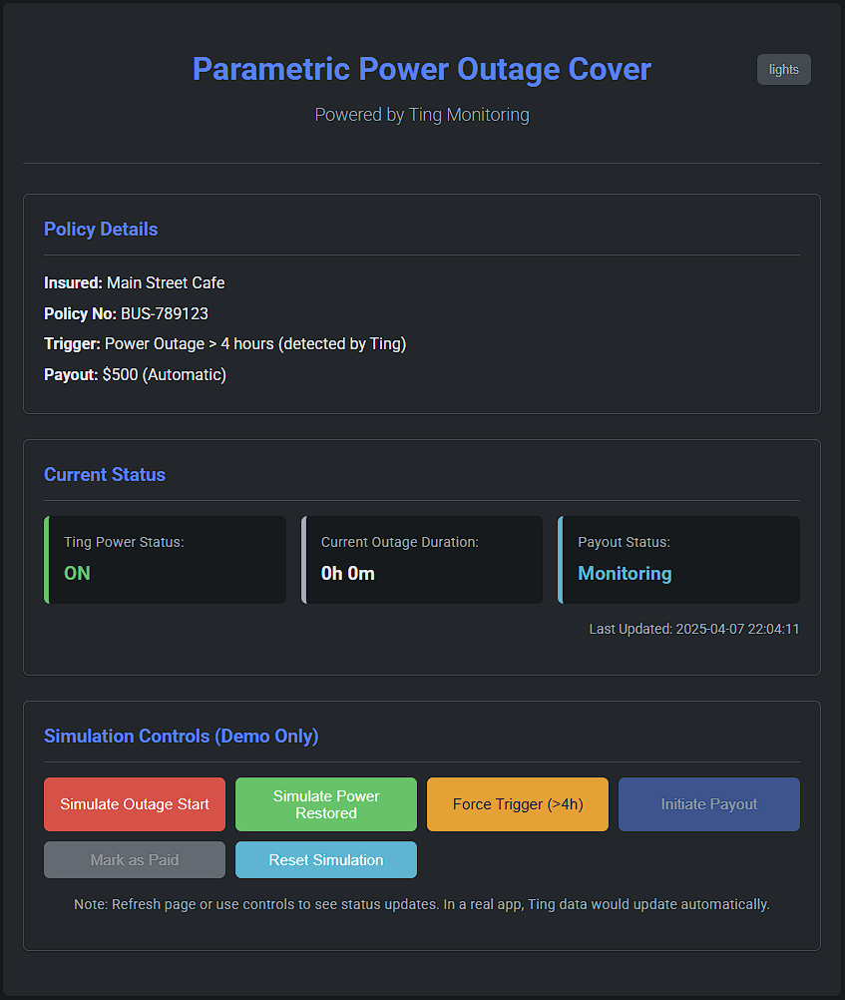

# Hackathon
A lean flask application that illustrates what Parametric Insurance _could_ look like within the enterprise.

## Use Case
Business Interruption (Power Outage):

 - **Concept:** A policy for a small business highly dependent on continuous power (e.g., restaurant with refrigerators, small server host).
 - **Parameter:** Duration of a verified power outage affecting the business's specific grid location. Data sourced from the utility company or a reliable third-party monitor.
 - **Trigger:** Verified power outage duration exceeds a threshold (e.g., 4 consecutive hours).
 - **Payout:** A fixed amount (e.g., $500) to cover initial losses like spoiled goods or basic continuity measures.
Prototype Focus: Dashboard showing the business policy details. Simulate a "Utility Power Status Feed". Button: "Simulate Outage Report: Verified Outage Duration = 5 hours". This triggers the status update: "Trigger Met! Business Interruption Payout of $500 Initiated."

## Tech Stack
The application is written in Python using Flask. The dataset, and real-world connection would come from [Ting](https://power-quality.tingfire.com/)

## Screenshot

